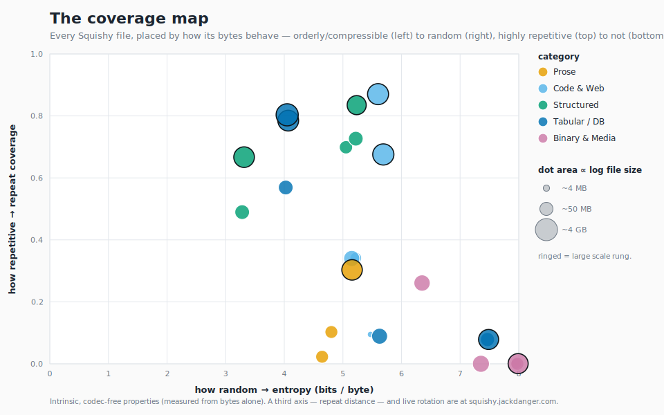

# Squishy

**Squishy is the 2026 compression corpus: one curated set of real, redistributable
files, chosen to span the full range of how data actually compresses. Run your
codec (compression program) over it to get a Squishy Score — a single, citable
compression-ratio number.**



*Every file in the corpus, placed by how its bytes behave — **left→right: orderly
and compressible → random and incompressible; bottom→top: little internal
repetition → lots.** The files spread across that space instead of clumping in one
spot, which is what makes "I tested on Squishy" mean something.
[How to read this →](#the-coverage-map)*

## Start here

| If you want to… | Go to |
|---|---|
| **Just get a number** for your codec | [Quickstart](#quickstart) |
| **Decide whether to trust it** | [What Squishy believes](VALUES.md) · [the coverage map](#the-coverage-map) |
| **Report or submit** a score | [`RULES.md`](RULES.md) |
| **Curate or govern** an edition | [`GOVERNANCE.md`](GOVERNANCE.md) |

## Quickstart

```
git clone https://github.com/JackDanger/squishy-corpus && cd squishy-corpus
uv run squishy-calculate --cmd "zstd -19 -c"   # streams + verifies the FULL corpus, scores your codec
→ Squishy Score (draft): N.NN×   # real & reproducible NOW — citable once v1.0 freezes (DOI pending)
```

You get a **real, reproducible number today**; a **citable** number lands at the
v1.0 freeze. We keep those two separate on purpose — labelling a draft a draft is
[value #1](VALUES.md). The runner verifies every file against its published
SHA-256 (fail-closed on any mismatch), caches results, and is resumable.

> **Which number?** Two panels exist and they are *not* the same: a quick
> **small-member** panel (zstd -19 = **4.15×**, table in the [reference
> board](#reference-board)) for ranking codecs fast, and the **complete-edition**
> run, which is larger and is the only thing that ever prints a citable *Squishy
> Score* — none exists yet (the one near-complete run is flagged `DO_NOT_CITE`).
> [What the numbers mean →](#what-the-numbers-mean)

## What the numbers mean

| term | one line | reading |
|---|---|---|
| **Squishy Score** (`×`) | equal-vote quality index — *geometric mean* of per-file ratio (multiply the ratios, take the Nth root, so no single huge file dominates), one vote per file | **higher is better**; a dimensionless index, **not** a bit rate |
| **ratio** | a single file's `uncompressed ÷ compressed` | **higher is better**; `3×` means it shrank to a third |
| **corpus bpb** | size-weighted physical rate — `8 · total compressed ÷ total input` | **lower is better**; the operational bits/byte the literature uses |
| **kind** | a named member of the corpus (`dickens`, `log`, `weights`, …) | what you pick from when stress-testing |
| **edition** | a frozen, dated, DOI-pinned file set (`Squishy-2026`, freezes at v1.0) | what you cite — a number without one is meaningless |

Score and bpb are **deliberate complements**, always shown together: the Score
weights every file equally (so no giant file can be gamed); bpb is the honest
size-weighted rate. **Cite the Score; read bpb as the cross-check.** They diverge
on purpose — for one file `bpb = 8 ÷ ratio`, but across the corpus the Score is
equal-per-file while bpb is byte-weighted, so don't derive one from the other.

## What is Squishy

Squishy is a successor to the Silesia corpus for 2026: a fixed set of **real,
redistributable files**, each measured along a few intrinsic properties — *how
random the bytes are, how repetitive, how far back the repeats sit, and how big
the file is* — and deliberately chosen to **span that range** rather than pile up
in one corner of it. [What the project believes and why →](VALUES.md)

**One corpus, two jobs — and the three people it's for:**

- **Measure ratio** — for *the ratio researcher* innovating on how small files
  get. Run your compressor over the whole corpus for a **Squishy Score**: one
  geometric-mean number, citable and pinned to a frozen edition. You recompute it
  when you change your *algorithm*, not every commit — it's your scoreboard across
  editions.
- **Test behavior** — for *the implementer hardening a codec* (say, a faster
  gzip-compatible encoder that emits the *same bytes*). Its Score barely moves
  from stock, so the value is a representative battery of real inputs to catch
  **time / CPU / memory regressions**. Because the files span byte structure *and*
  size (tens of MB to multi-GB), "I tested on Squishy" means "across the real
  diversity of inputs a compressor sees," not "on a random pile."
- **Cite & reproduce** — for *the archivist or paper author* who needs a fixed,
  provenanced, DOI-frozen dataset they can name and others can reproduce exactly.

All three rest on the *same* property: the corpus is **diverse and
representative**, and the [coverage map](#the-coverage-map) is the evidence.

## The coverage map

Compressors behave differently depending on the *shape* of the input — random
media vs. repetitive logs, nearby matches vs. long-range ones — and differently
again at *scale*, where window size, long-range matching, and parallel block
decode start to matter. So each artifact is measured on four intrinsic,
**codec-free** properties (computed from the bytes alone, never from how some
compressor performs):

- **how random** — order-0 entropy (bits/byte)
- **how repetitive** — fraction of the file that is exact repetition
- **repeat distance** — how far back those repeats sit (local vs. long-range)
- **how big** — file size

The files are **sparse in this space — not a dense grid — but representative of
the whole**: we claim *coverage of the range*, not completeness. These are the
dimensions along which compressors are *known* to behave differently, so they
explain **why each file is here** and make the selection representative — they
describe the file, they don't *predict* its ratio, and they are **not** a weight
in the score. The [map at the top](build/meta/coverage-map.svg) plots two of them
(entropy × repeat coverage, dot area ∝ log size); the live 3D explorer adds the
third (repeat distance) and rotates, at
[squishy.jackdanger.com](https://squishy.jackdanger.com) *(soon)*.

## The Squishy Score

> **Squishy Score (of a codec) = the geometric mean of the per-file compression
> ratio (uncompressed ÷ compressed) over the whole corpus — one vote per file.**

- **Plain geomean, one vote per file.** No category/kind weighting in the formula, no
  tuning constants, and no threshold deciding which files count. Every file is
  averaged once; the geometric mean is what stops any single huge or tiny file from
  running away with the number. (Design rationale:
  [`plans/score-weighting-critique-and-proposal.md`](plans/score-weighting-critique-and-proposal.md).)
- **One honest consequence: file *count* is the only weight.** A kind sampled at two
  sizes votes twice; a single-size kind votes once. There's no hidden math here — the
  weighting lives entirely in *what's in the corpus*, so the corpus is curated to keep
  the per-kind file count balanced and the members structurally independent (no two
  members sharing a source/lineage). That curation, not a formula knob, is where
  balance is enforced — see `RULES.md` and the kinds×sizes table below.
- **Every real file counts — including the near-incompressible media.** `photo`,
  `movie`, and `weights` score ~1.0×, which lowers the headline by nearly the same
  factor for every codec, so they barely move the ranking — and a corpus of real data
  honestly contains some incompressible files. (A codec that genuinely squeezes them
  from 1.00× to 1.05× earns that; it just can't *win* on them.) The only thing left
  out is the unmeasured model-weight **throughput ladder** (a speed/RAM fixture, not a
  ratio corpus member).
- Reported as **"×"** (2 decimals), always beside the **corpus bpb** (3 decimals)
  — see [What the numbers mean](#what-the-numbers-mean) for how the two complement.
- **Whole-corpus and periodic.** It's expensive and meant to be *stable* — you run
  it when you change your algorithm, not per commit. The corpus may be tens of GB.
- **Lossless round-trip required**; **speed is not in the score** (it isn't
  cross-machine reproducible — it lives on a leaderboard).
- A number is a property of *(codec, setting, codec-version, codec-argv,
  corpus-edition)*. See [`RULES.md`](RULES.md).

There is **one corpus and one number** — no subset and no second score. A run over
the *complete* edition is the only thing that prints a Squishy Score; running over
a handful of files (for CI/dev) prints per-file ratios for your own regression
diffs, not a headline.

## The corpus

Memorable like Silesia — you can name the **kinds**. Every file is **real and
provenanced** (sources, licenses, SHA-256 in
[`build/meta/LICENSE-MANIFEST.csv`](build/meta/LICENSE-MANIFEST.csv)).

| Category | Kinds |
|----------|-------|
| **Prose** | `dickens` (Dickens, PD) · `aozora` (Natsume Sōseki, PD Japanese) |
| **Code & Web** | `monorepo` (LLVM/clang source) · `minjs` (Plotly.js, minified) · `markup` (Bosak Shakespeare XML) |
| **Structured** | `json` (USGS earthquakes) · `log` (NASA-HTTP server log) · `genome` (E. coli FASTQ) |
| **Tabular / DB** | `csv` (NOAA daily weather) · `parquet` (US DOT airline on-time) · `sqlite` (USDA nutrition DB) |
| **Binary & Media** | `exe` (Hugo binary) · `symbols` (Lua DWARF debug-info) · `wasm` (SQLite→WebAssembly) · `winexe` (fd, Windows PE) · `armexe` (hyperfine, ARM64 ELF) · `photo` (NASA "Blue Marble" JPEG) · `movie` (Big Buck Bunny) · `weights` (a Transformer's safetensors) |

Binary & Media now spans five compiled/executable formats — Linux ELF (`exe`),
Windows PE (`winexe`), ARM64 ELF (`armexe`), WebAssembly (`wasm`), and DWARF
debug-info (`symbols`) — chosen because compiled artifacts compress very
differently by ISA, format, and symbol content. `symbols` (entropy 4.54) fills
the low-entropy/high-text binary corner that the category previously lacked;
`wasm` is stack-machine bytecode; `winexe` adds the PE format and `armexe` the
ARM64 ISA.
This is intrinsic-property coverage, not category weighting — categories
organize, they never weight the score.

The size axis is real: people compress 40 MB files *and* multi-GB ones, so the
corpus carries **large members (0.3–4 GB+) that extend well past today's codec
window sizes** — that's where long-range matching and large-window modelling start
to matter, and where a future large-file codec earns its keep. Large members
acquired (all PD / permissive, whole-file measured):

- **`csv`** — NOAA GHCN-Daily, **4.07 GB** (2021–2023). This is the `csv`
  *length* rung; it scales the human-scale `csv` kind cell (the 2024 slice) at
  **disjoint years**, so the two share no bytes. (The 1.33 GB 2024-full file — a
  strict prefix of the small slice — was dropped to an unscored diagnostic.)
- **`monorepo`** — full LLVM source tree, 1.77 GB
- **`archive`** — four clang release source trees concatenated, 1.50 GB: a real
  release-mirror/backup artifact (high repetition with duplicates hundreds of MB
  apart — the long-range corner nothing else covers)
- **`genome`** — full E. coli run, 1.07 GB · **`markup`** — enwik9, 1.0 GB
  (Wikipedia XML, the `markup` length rung) · **`log`** — full NASA-HTTP Jul+Aug,
  0.37 GB · **`parquet`** — US DOT airline on-time, multi-year columnar

`json` and `sqlite` stay single-size: their byte-property region is already
represented (by `log` and `csv` respectively) and the size axis is carried by the
rungs above. The **near-incompressible** kinds (`photo`, `movie`, `weights`) also
stay single-size — a 3 GB JPEG tells you nothing a 90 MB one didn't (the 1080p
movie and the model-weights ladder ship as throughput/behaviour diagnostics, not
scored rungs).

## Run it

**Zero setup — stream the corpus and score in one command:**

```bash
squishy-calculate --cmd "zstd -19 -c"                       # score a stdin→stdout codec
squishy-calculate --cmd "xz -9 -c" --verify --decompress "xz -dc"   # + prove losslessness
squishy-calculate --cmd "mycodec -o {out} {in}"             # file-arg codecs
```

`squishy-calculate` streams each file from the published mirror, **verifies it
against the published SHA-256 and refuses to score unverifiable bytes** (fail
closed), caches verified bytes + per-file results, and is **resumable** and
**idempotent** (same codec + bytes ⇒ the same number, instantly). Point it at any
mirror with `--base`.

**For CI / dev,** pull whatever files stress your code — each is individually
addressable by name in the edition manifest
([`build/meta/edition.json`](build/meta/edition.json): per-file HTTPS URL + SHA-256
+ size + kind) — and check the [coverage map](#the-coverage-map) for
representativeness. A partial run prints per-file ratios for your own regression
diffs, [not a Squishy Score](#the-squishy-score).
**Already have the bytes?** `squishy bench --cmd "…"` is the same runner's
local-bytes path (both `squishy-calculate` and `squishy bench` are implemented in
`scripts/squishy.py`).

## Reference board

There is **no complete-edition Squishy Score yet** — the only full-corpus run on
record ([`build/meta/squishy-score-complete.json`](build/meta/squishy-score-complete.json))
is flagged `DO_NOT_CITE`: it predates folding the near-incompressible members into the
score (so its number is an over-estimate) and there's no frozen edition/DOI behind it.
What *is* real: the large rungs compress better than their small siblings (LLVM 12.6×,
csv-4 GB 12.6×, clang-archive 17.5×) — long-range matching at scale shows up in the
per-file ratios.

The table below is the **fast panel over the small members only** (draft) — handy
for ranking codecs quickly; the full panel over the complete edition (the **26
scored cells** declared in [`build/meta/schema.json`](build/meta/schema.json)) is the
expensive periodic computation. Every codec build is pinned in
[`build/tools.lock`](build/tools.lock). This panel predates the 4 new Binary & Media
cells (`symbols`, `wasm`, `winexe`, `armexe`) and the large rungs; once those bytes
are published and re-scored with the pinned codec builds the full roster folds into
the panel.

| codec | Squishy Score (×) | corpus bpb (byte-weighted) |
|-------|------------------:|---------------------------:|
| xz -9 | 4.37× | 2.977 |
| brotli -11 | 4.34× | 3.021 |
| zstd -22 | 4.20× | 3.092 |
| zstd -19 | 4.15× | 3.106 |
| bzip2 -9 | 3.98× | 3.278 |
| gzip -9 | 3.23× | 3.495 |

Columns are the **Squishy Score** (×, equal-vote) and **corpus bpb**
(byte-weighted) — see [What the numbers mean](#what-the-numbers-mean). Only
**mainstream, version-pinned, installable** codecs are on the reproducible board;
high-ratio context-mixing codecs (zpaq/cmix/paq) are submitter-reported on the
leaderboard, since a hand-carried binary can't be reproduced bit-for-bit by a
third party.

## Editions & permanence

- **Versioned, dated editions.** The edition manifest pins the exact set of
  `(kind, size)` members, so two people citing "Squishy-2026" can't silently
  disagree. A codec overfit to one edition visibly stops winning on the next.
- **Hosted footprint stays small.** Large files are **hosted where their size is
  load-bearing** (real long-range structure — csv, genome, repo); incompressible
  and pathological large inputs ship as **seeded generators + published SHA-256**
  that regenerate bit-for-bit. A tens-of-GB benchmark inside a ~10–20 GB mirror.
- **Permanent home:** a Zenodo DOI (defeats link-rot); the public S3 bucket is a
  mirror accessed via the edition manifest of HTTPS URIs
  ([`edition.json`](build/meta/edition.json)). Every file's SHA-256 is
  published; anyone can recompute the score with a pinned codec build.

## Licensing

Every file is redistributable (Public-Domain / CC-BY / Apache-2.0 / MIT), with
source URL, license, and SHA-256 in
[`build/meta/LICENSE-MANIFEST.csv`](build/meta/LICENSE-MANIFEST.csv). `movie` (Big
Buck Bunny) is © Blender Foundation, CC-BY 3.0. The build system is [MIT](LICENSE).

---

*Status: pre-1.0. The scored roster is constituted as **26 cells** in
[`build/meta/schema.json`](build/meta/schema.json) (19 small named members + 6 large
rungs + the `archive` long-range member; the near-incompressible budget is 3). The 4
newest Binary & Media cells (`symbols`, `wasm`, `winexe`, `armexe`) are in the manifest
but their bytes are pending upload to the public mirror — a complete streaming run will
404 on them until the next `make publish`, and the reference board still reflects the
older small-member set. The complete-edition Squishy Score is computed once those bytes
land; the edition **will be** frozen and DOI-minted at `v1.0.0`. Roadmap:
[`plans/squishy-1.0-readiness.md`](plans/squishy-1.0-readiness.md).*
